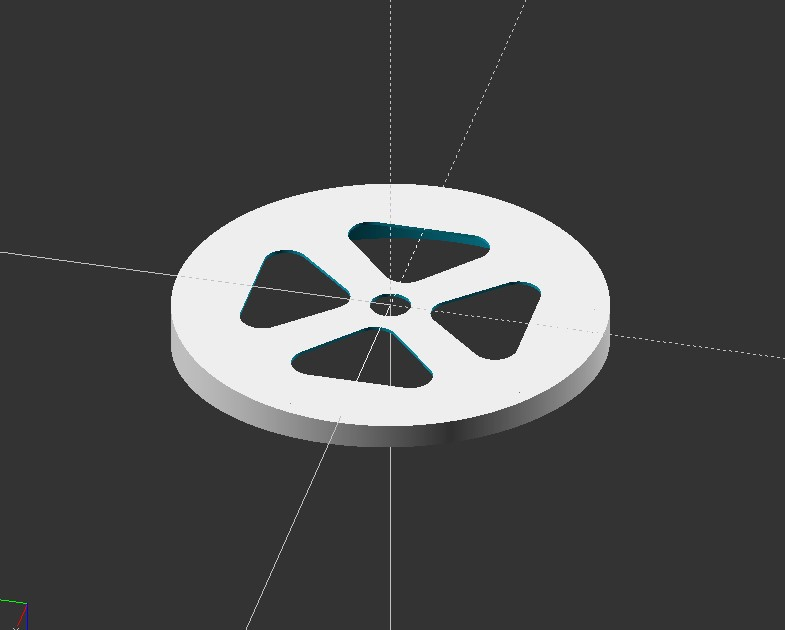
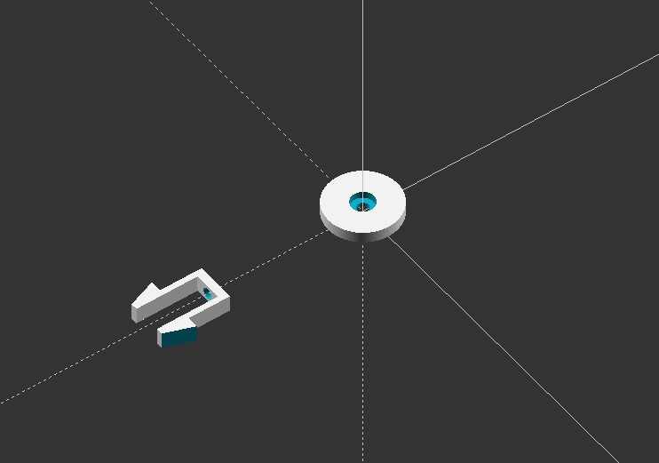
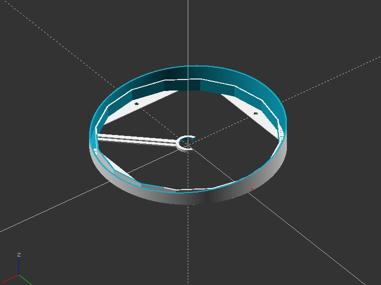
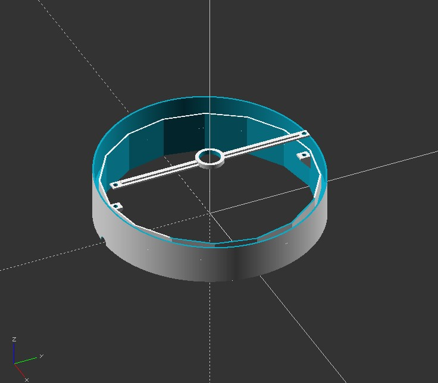

# 3dprint-ikea-hack-vidja
 

## IKEA hack for VIDJA lamp

Replace the plastic part of the lamp to customize it and make it less "plasticky".
You will need to print:

- 1x top
- 1x top clip
- 1x bottom
- 1x bottom link
- 4x middle

The middle part are simply assembled back to back with 2 bolts. You will need some M4 screws and bolts.

Made with OpenSCAD.

## IKEA hack pour la lampe VIDJA

Remplacer les parties plastiques de la lampe pour la personnaliser et lui donner un aspect moins "plastique".
Il faudra imprimer :

- 1x top
- 1x top clip
- 1x bottom
- 1x bottom link
- 4x middle

Les middle s'assemblent simplement en les mettant dos à dos et en les vissant avec 2 petits boulons. Vous aurez besoin de quelques vis et boulons M4

Réalisé avec OpenSCAD.

